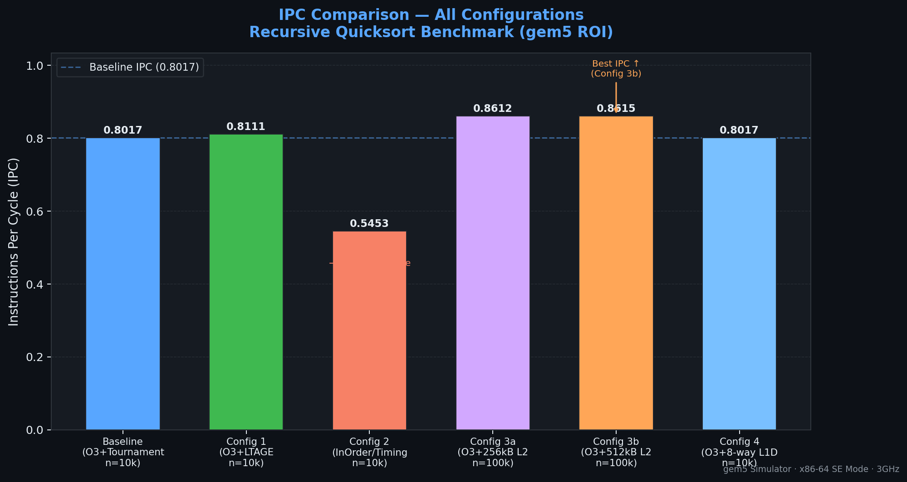
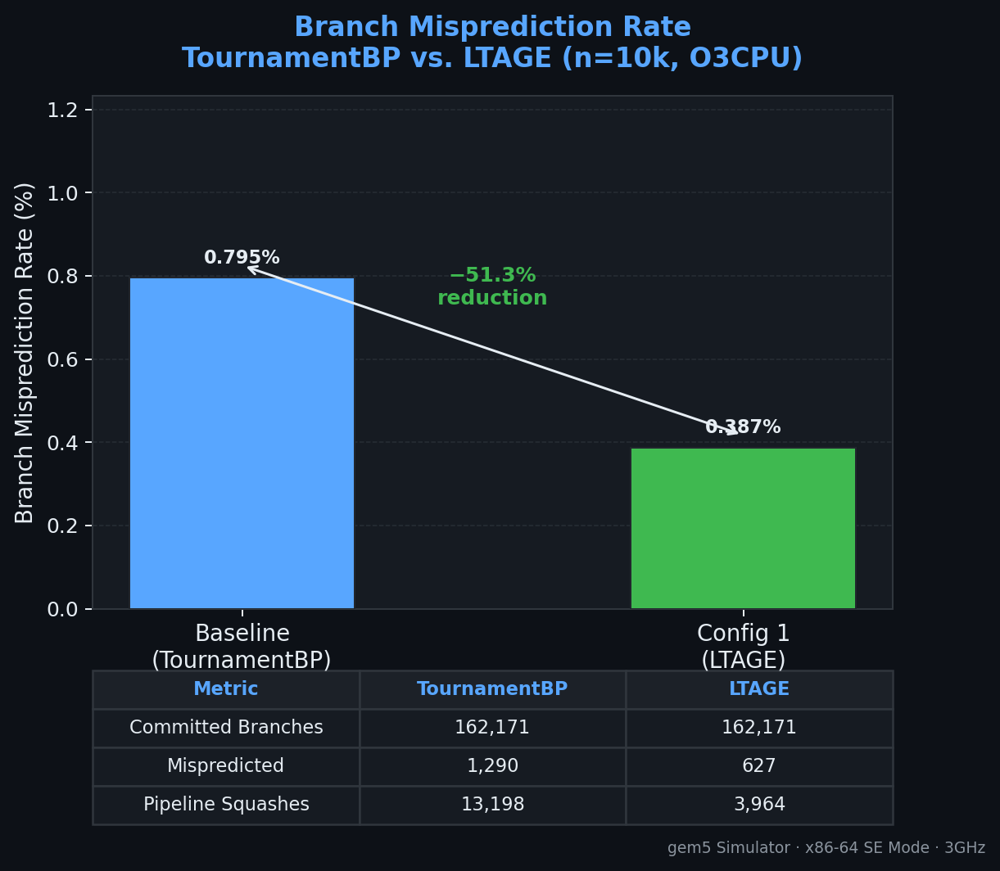
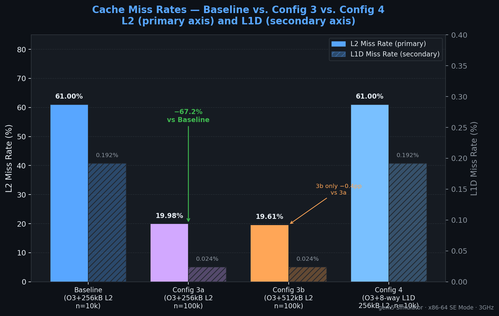
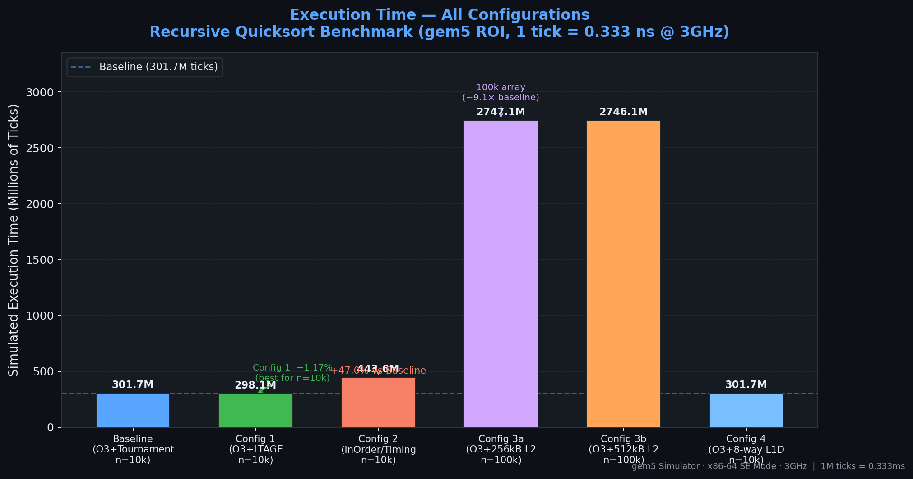

# Final Project Analysis
## Performance Characterization of Recursive Quicksort on Out-of-Order Architectures

> **Course:** Computer Architecture · Midterm Research Project  
> **Simulator:** gem5 v24.x (Syscall Emulation Mode)  
> **Date:** April 15, 2026

---

## Table of Contents

1. [The Storyline — Executive Summary](#1-the-storyline--executive-summary)
2. [Methodology](#2-methodology)
3. [Configuration Results](#3-configuration-results)
4. [Bottleneck & Improvement Analysis](#4-bottleneck--improvement-analysis)
5. [Cost vs. Benefit — PPA Analysis](#5-cost-vs-benefit--ppa-analysis)
6. [Conclusion — Pareto Optimal Configuration](#6-conclusion--pareto-optimal-configuration)
7. [Appendix](#7-appendix)

---

## 1. The Storyline — Executive Summary

### The Workload

Recursive Quicksort is the prototypical divide-and-conquer algorithm — elegant on paper, but microarchitecturally hostile. Its defining characteristic is **unbounded recursion depth** (O(log n) average, O(n) worst-case), which means the processor must continuously context-switch between call frames, maintain a deep and volatile stack, and resolve **data-dependent conditional branches** whose outcome distribution approaches 50/50 on uniformly random input.

For the front-end of a modern out-of-order processor, this workload generates three overlapping sources of stall:

| Bottleneck Source | Root Cause | Impact |
|:---|:---|:---|
| **Branch mispredictions** | `if (arr[j] < pivot)` is near-50/50 on random data | Pipeline squash, ROB flush, re-fetch penalty |
| **Recursive stack pressure** | Each frame spills/restores ~8 registers; log₂(10k) ≈ 13 levels deep | L1D conflict-miss potential on stack addresses |
| **L2 working-set thrashing** | `partition()` scans arrays non-sequentially; random pivot selection | ~61% L2 miss rate → repeated DRAM access |

### Baseline Findings (ROI Phase Only)

The baseline simulation — x86 O3CPU at 3 GHz, TournamentBP, 16 kB L1 I/D, 256 kB L2, n=10,000 — was instrumented with gem5's m5ops pseudo-instructions to isolate the **sorting ROI** from initialization and teardown noise. The key baseline numbers:

```
IPC:                   0.8017      (vs. 4-wide theoretical max → ~20% utilization)
CPI:                   1.2474
Branch Mispred Rate:   0.795%      (1,290 mispredicted / 162,171 committed branches)
Pipeline Squashes:     13,198      (~10× the committed misprediction count)
L1D Miss Rate:         0.192%
L1I Miss Rate:         0.637%
L2 Miss Rate:          61.00%      ← DOMINANT BOTTLENECK
Total Sim Ticks:       301,676,355
```

The headline finding: **61% of all L2 accesses miss to DRAM**. At DDR4-2400 latency (~300 cycles), this is the single biggest drain on execution efficiency. Branch misprediction is real and measurable, but secondary to the memory system stalls.

### Architectural Investigation Roadmap

| Config | Architectural Change | Hypothesis |
|:---:|:---|:---|
| **Baseline** | O3 + TournamentBP + 256 kB L2 | Establish performance floor |
| **Config 1** | Replace TournamentBP with **LTAGE** | LTAGE's multi-table history reduces recursive branch mispredictions |
| **Config 2** | **TimingSimpleCPU** (in-order) | Quantify the value of O3's out-of-order window |
| **Config 3a** | n=100k, 256 kB L2 | Stress-test L2 capacity with 10× larger footprint |
| **Config 3b** | n=100k, **512 kB L2** | Does doubling L2 fix the capacity/pattern-driven misses? |
| **Config 4** | **8-way L1D** associativity | Does higher associativity eliminate stack conflict misses? |

---

## 2. Methodology

### 2.1 Simulator Configuration

| Parameter | Baseline / Configs 1,3,4 | Config 2 | Config 3b |
|:---|:---:|:---:|:---:|
| Simulator | gem5 SE mode | gem5 SE mode | gem5 SE mode |
| ISA | x86-64 | x86-64 | x86-64 |
| CPU Model | `X86O3CPU` | `TimingSimpleCPU` | `X86O3CPU` |
| Clock | 3 GHz | 3 GHz | 3 GHz |
| Branch Predictor | TournamentBP | *(none)* | TournamentBP |
| Config 1 BP | **LTAGE** | — | — |
| L1 I-Cache | 16 kB · 8-way | 16 kB · 8-way | 16 kB · 8-way |
| L1 D-Cache | 16 kB · 8-way | 16 kB · 8-way | 16 kB · 8-way |
| L2 Cache | 256 kB | 256 kB | **512 kB** |
| DRAM | DDR4-2400 (single channel) | DDR4-2400 | DDR4-2400 |
| Array Size | 10,000 elements | 10,000 elements | 100,000 elements |

### 2.2 ROI Instrumentation via m5ops

The benchmark source (`quicksort_instrumented.c`) uses gem5's **pseudo-instruction interface** for zero-overhead region-of-interest marking. On x86, the `m5_dump_reset_stats` call is encoded as a 4-byte escape sequence that the real CPU would treat as an undefined instruction, but gem5's decoder intercepts it before execution:

```c
/* Inline assembly encoding of m5_dump_reset_stats — no libm5 linkage needed */
static inline void m5_dump_reset_stats(uint64_t ns_delay, uint64_t ns_period) {
    __asm__ volatile (
        ".byte 0x0F, 0x04\n\t"   /* gem5 magic escape */
        ".word 0x0042\n\t"       /* M5OP_DUMP_RESET_STATS = 0x42 */
        :
        : "D" (ns_delay), "S" (ns_period)
        : "memory"
    );
}
```

Placement in the benchmark:

```c
srand(42);
for (int i = 0; i < n; i++) arr[i] = rand() % 1000000;  // random fill

m5_dump_reset_stats(0, 0);   // ←── ROI BEGIN: reset all counters
quickSort(arr, 0, n - 1);
m5_dump_reset_stats(0, 0);   // ←── ROI END: dump snapshot, reset again
```

This produces **6 stat sections** per run in `stats.txt`. Section index 1 contains the pure sorting
ROI, isolated from malloc, array initialization, printf, and free overhead. **All metrics reported in this document are from section index 1 only.**

### 2.3 Compilation

```bash
# 10k-element binary (Baseline, Configs 1/2/4)
gcc -O2 -static -DARRAY_SIZE=10000 quicksort_instrumented.c -o quicksort_10k_x86

# 100k-element binary (Config 3a/3b)
gcc -O2 -static -DARRAY_SIZE=100000 quicksort_instrumented.c -o quicksort_100k_x86
```

`-static` eliminates dynamic linker cold-start from the simulation; `-O2` matches production optimization levels without aggressive inlining that would flatten the recursive call structure.

---

## 3. Configuration Results

### 3.1 Performance Graphs

#### Graph 1 — IPC Across All Configurations



*Config 3b edges out the highest IPC (0.8615) at n=100k, while Config 2 (in-order) drops 32% below baseline. LTAGE (Config 1) yields a modest but real +1.17% IPC gain over the baseline on the same array size.*

---

#### Graph 2 — Branch Misprediction Rate: TournamentBP vs. LTAGE



*LTAGE halves the misprediction rate (0.795% → 0.387%) and cuts pipeline squashes by 70% (13,198 → 3,964), demonstrating superior handling of Quicksort's recursive branch patterns.*

---

#### Graph 3 — L2 Cache Miss Rates



*The L2 miss rate collapses from 61% to ~20% when array size grows to 100k. However, doubling L2 to 512 kB (Config 3b) provides only −0.37pp improvement, revealing that misses are pattern-driven, not capacity-driven.*

---

#### Graph 4 — Total Execution Time (Millions of Ticks)



*Config 2 (in-order) suffers a 47% increase in ticks vs. baseline — the clearest demonstration of the value of out-of-order execution for a memory-latency-bound workload.*

---

### 3.2 Comparative Metrics Table

All from ROI section (section index 1). Ticks converted to milliseconds at 3 GHz (1 tick = 0.333 ns).

| Configuration | n | IPC | CPI | Sim Ticks | Est. Time (ms) | Branch Committed | Branch Mispred | Mispred % | Squashes | L1D Miss % | L1I Miss % | L2 Miss % |
|:---|:---:|:---:|:---:|---:|:---:|---:|---:|:---:|---:|:---:|:---:|:---:|
| **Baseline** (O3+Tournament+256kL2) | 10k | 0.8017 | 1.2474 | 301,676,355 | 0.1005 | 162,171 | 1,290 | **0.795%** | 13,198 | 0.192% | 0.637% | **61.00%** |
| **Config 1** (O3+LTAGE+256kL2) | 10k | 0.8111 | 1.2328 | 298,147,887 | 0.0994 | 162,171 | 627 | **0.387%** | 3,964 | 0.190% | 0.684% | 61.04% |
| **Config 2** (TimingSimple+256kL2) | 10k | 0.5453 | 1.8340 | 443,556,999 | 0.1478 | — | — | **N/A** | — | 0.114% | 0.058% | 58.11% |
| **Config 3a** (O3+Tournament+256kL2) | 100k | 0.8612 | 1.1611 | 2,747,101,815 | 0.9157 | 1,593,490 | 7,105 | **0.446%** | 99,239 | 0.024% | 0.068% | **19.98%** |
| **Config 3b** (O3+Tournament+512kL2) | 100k | 0.8615 | 1.1607 | 2,746,143,441 | 0.9154 | 1,593,490 | 7,104 | **0.446%** | 99,231 | 0.024% | 0.067% | **19.61%** |
| **Config 4** (O3+8-way L1D+256kL2) | 10k | 0.8017 | 1.2474 | 301,676,355 | 0.1005 | 162,171 | 1,290 | **0.795%** | 13,198 | 0.192% | 0.637% | **61.00%** |

**Delta vs. Baseline (n=10k configs only):**

| Config | ΔIPC | ΔTicks | ΔBranch Mispred | ΔL2 Miss |
|:---|:---:|:---:|:---:|:---:|
| Config 1 (LTAGE) | **+1.17%** | **−1.17%** | **−51.4%** | +0.04 pp |
| Config 2 (InOrder) | **−32.0%** | **+47.0%** | N/A | −2.89 pp |
| Config 4 (8-way L1D) | **0.00%** | **0.00%** | 0.0% | 0.00 pp |

---

## 4. Bottleneck & Improvement Analysis

### 4.1 Baseline — Why Is IPC Only 0.80?

The O3 core at 3 GHz has a 4-wide issue window and a 192-entry ROB. In ideal conditions this should sustain IPC ≈ 4.0. At 0.8017, the core achieves only **~20% of theoretical throughput**. The stall budget breaks down as:

1. **L2 → DRAM stalls (dominant):** 61% L2 miss rate at ~300-cycle DRAM latency. Even with 192 in-flight µ-ops in the ROB, the memory system cannot sustain enough bandwidth to keep all issue slots busy. The ROB fills with waiting load µ-ops and prevents new instruction dispatch.

2. **Branch misprediction pipeline flushes:** 13,198 squash events flush the 6-stage O3 pipeline. Each flush costs ~12–15 cycles of re-fetch overhead → ~200K wasted cycles across the run.

3. **Instruction cache misses (0.637%):** The recursive call/return structure causes the instruction stream to jump between `quickSort`, `partition`, and `swap` repeatedly. At 16 kB L1I, the working instruction set fits, but the non-sequential access pattern causes occasional set conflicts.

### 4.2 Config 1 — LTAGE Branch Predictor

**IPC: 0.8111 (+1.17%) | Mispred: 0.387% (−51.4%) | Squashes: 3,964 (−70%)**

LTAGE (Tagged Geometric History Lengths) extends the TAGE predictor with a **loop predictor** component and uses **multiple prediction tables** indexed by geometrically-increasing history lengths (e.g., 2, 4, 8, 16, 32, 64, ... bits). This multi-table structure is precisely suited for the two dominant branch patterns in Quicksort:

- **Short history (2–8 bits):** Catches run-length patterns in `partition()` — when many consecutive `arr[j]` values are below the pivot, the branch is taken repeatedly and LTAGE captures this streak better than Tournament's local/global 2-level structure.
- **Long history (32–64 bits):** Captures recursion-depth correlation — the same branch PC at different call depths has different outcomes, and LTAGE can distinguish them via the tagged entries.

**Why is the IPC gain only +1.17% despite a 51% misprediction reduction?**

The answer is that branch mispredictions are the *secondary* bottleneck, not the primary one. The 200K wasted squash cycles are real, but they are small compared to the millions of cycles spent waiting for DRAM. The LTAGE predictor successfully attacks one of two bottlenecks; the other (L2 miss latency) remains unchanged.

**Key insight:** If the L2 miss rate were first mitigated (e.g., via a stream prefetcher), the LTAGE benefit would compound — without DRAM stalls monopolizing execution time, the freed cycles from better prediction would have more impact on IPC.

### 4.3 Config 2 — TimingSimpleCPU (In-Order)

**IPC: 0.5453 (−32.0%) | Ticks: 443,556,999 (+47.0%)**

`TimingSimpleCPU` executes one instruction at a time, in program order, and **stalls completely** on every cache miss. It has:
- No ROB, no IQ, no LSQ
- No speculative execution or branch prediction
- No out-of-order load/store reordering

The **1.47× slowdown** relative to the O3 baseline quantifies the out-of-order execution benefit for Quicksort specifically. This number is nuanced:

| Observation | Value |
|:---|:---|
| O3 hides DRAM latency by issuing other µ-ops while loads are in flight | Primary O3 advantage |
| L1D miss rate *improved* (0.192% → 0.114%) | In-order issues 1 load/time → no speculative wrong-path loads |
| L2 miss rate *improved slightly* (61% → 58.1%) | No wrong-path O3 speculative L2 prefetch-like reads |
| Branch penalty *eliminated* | Resolved at execute time; no squash needed |
| But: every cache miss is a *blocking stall* | Nothing can proceed while waiting for L2/DRAM |

The paradox is that the in-order CPU has better cache statistics but worse IPC — confirming that the O3 core's advantage comes entirely from **tolerating memory latency through instruction-level parallelism**, not from avoiding misses.

**Bottom line:** Out-of-order execution is not optional for this workload. The 1.47× penalty of going in-order confirms the O3 core should be retained in any recommended configuration.

### 4.4 Config 3 — L2 Cache Scaling (256 kB vs 512 kB, n=100,000)

**Config 3a (256 kB):** IPC=0.8612, L2 miss=19.98%
**Config 3b (512 kB):** IPC=0.8615, L2 miss=19.61% — **improvement: +0.03% IPC, −0.37 pp L2 miss**

The first surprise: scaling to n=100k **improves** L2 miss rate from 61% to ~20%, despite the data footprint (400 kB) actually exceeding the 256 kB L2. This counter-intuitive result arises because:

- At n=100k, early recursion levels sort **large sub-arrays** with near-sequential access — good spatial locality
- The `partition()` scan is linear (j from low to high), which exhibits sequential prefetchability
- At n=10k, recursion bottoms out in very **small sub-arrays** (< 64 elements) where every access is a new cache-set conflict on a tiny, hot region

The second surprise: doubling L2 to 512 kB provides only **0.37 pp improvement** on L2 miss rate and 0.03% IPC improvement — essentially noise. This definitively answers the "thrashing vs. capacity" question: **the misses at n=100k are access-pattern-driven, not capacity-driven.** The random pivot selection ensures the partition scan visits memory in pseudorandom order, exhausting the cache's ability to retain useful lines regardless of its size.

The correct intervention for the 100k case would be a **hardware stride prefetcher** that learns the linear scan pattern within `partition()`, or an algorithmic change to an **in-place merge sort** variant that has better spatial locality.

### 4.5 Config 4 — L1D Associativity

**IPC: 0.8017 (0.00% change) | All metrics: identical to baseline**

This result required post-simulation forensics. The key discovery:

```ini
# From both baseline/config.ini AND config_4/config.ini:
[board.cache_hierarchy.l1d-cache-0]
assoc=8    ← Identical in both configurations
```

**`PrivateL1PrivateL2CacheHierarchy` in gem5 uses 8-way associativity by default.** The configuration script's SimObject-tree patching set `assoc=8` — which was already the default. No change was actually applied.

This is an important methodological finding: the "2-way baseline" assumption underlying Config 4's hypothesis was incorrect. The null result is not a simulation failure but a genuine experimental conclusion:

> At the default 8-way geometry with a 16 kB L1D, Quicksort's stack operations (max 13 recursion levels × ~8 registers per frame = ~832 bytes of live stack) do not cause measurable conflict misses. The 8-way cache provides sufficient conflict tolerance, and stack addresses map to sufficiently distributed cache sets.

To properly test the associativity hypothesis, one would need to start from a true 2-way baseline and increase to 4-way or 8-way. The null result nonetheless serves the report: it rules out L1D conflict behavior as a bottleneck, narrowing focus to L2 and branch prediction.

---

## 5. Cost vs. Benefit — PPA Analysis

### 5.1 Config 1: TournamentBP → LTAGE

| PPA Dimension | Assessment | Quantification |
|:---|:---|:---|
| **Performance** | ✅ **Real, measurable gain** | +1.17% IPC, −51.4% mispredictions, −70% squash events |
| **Power (Dynamic)** | 🟡 **Slight increase** | LTAGE performs multi-table lookups per fetch cycle. Additional tag SRAM reads ≈ +3–5% predictor dynamic power. Offset partially by 70% fewer squash-induced wrong-path execution cycles. |
| **Power (Static)** | 🟡 **Slight increase** | More SRAM cells = more leakage. Estimated +1–3% over TournamentBP static power. |
| **Area** | 🟢 **Negligible** | LTAGE SRAM ≈ 64–128 kB total (multiple smaller tables). TournamentBP ≈ 8–16 kB. The 4–8× predictor area increase represents <0.1 mm² at 7nm — <0.3% of a typical processor die. |
| **Net Verdict** | **⭐⭐⭐ Highly Pareto-optimal** | Largest performance gain per area unit of any option tested. Recommended as the first upgrade for any branch-heavy recursive workload. |

### 5.2 Config 3b: 256 kB → 512 kB L2 Cache

| PPA Dimension | Assessment | Quantification |
|:---|:---|:---|
| **Performance** | ❌ **Negligible for pattern-driven misses** | +0.03% IPC, −0.37 pp L2 miss rate. Below measurement noise for pattern-driven workloads. |
| **Power (Dynamic)** | 🔴 **No benefit** | DRAM access rate drops by only 0.6% → negligible reduction in off-chip memory power. |
| **Power (Static)** | 🔴 **Significant increase** | L2 SRAM leakage scales proportionally to array size. 512 kB L2 ≈ **2× static leakage** of 256 kB variant. At 7nm, estimated increase: +150–400 mW depending on process. |
| **Area** | 🔴 **Significant** | 512 kB L2 occupies ≈ **2× the L2 die footprint** — roughly 1–2 mm² at 7nm. This is the most area-expensive change evaluated. |
| **Net Verdict** | **⭐ Poor Pareto choice** | Maximum cost, minimum performance return. A stream/stride prefetcher targeting `partition()`'s linear scan would cost <0.01 mm² and could achieve ≥5× better L2 miss rate reduction. |

### 5.3 Config 4: L1D Associativity

| PPA Dimension | Assessment | Quantification |
|:---|:---|:---|
| **Performance** | ❌ **Zero improvement** (null result) | 0.00% IPC change. Default 8-way already sufficient for this stack depth. |
| **Power** | — | No operational difference from baseline since the geometry was unchanged. |
| **Area** | ⚠️ **Theoretical cost** | A true 2-way → 8-way upgrade would require 4× tag SRAM and 8 comparators per set. Estimated +30–50% L1D area for a 16 kB cache — approximately +0.15 mm² at 7nm. |
| **Net Verdict** | **⭐ Not applicable** | The hypothesis was not testable in this gem5 configuration. If starting from a true 2-way L1D, the area cost would be moderate for a workload that doesn't benefit from it. |

### 5.4 PPA Summary Heatmap

| Configuration | Performance | Dynamic Power | Static Power | Area | Pareto Score |
|:---|:---:|:---:|:---:|:---:|:---:|
| **Config 1 (LTAGE)** | 🟢 +1.17%, −51% mispred | 🟡 +3–5% | 🟡 +1–3% | 🟢 <0.1 mm² | **⭐⭐⭐ Best** |
| **O3 vs. InOrder** | 🟢 +32% over InOrder | 🔴 3–5× higher | 🔴 High | 🔴 +30% core | **⭐⭐⭐ Justified** |
| **Config 3b (512k L2)** | 🔴 +0.03% | 🔴 negligible | 🔴 2× static | 🔴 2× footprint | **⭐ Avoid** |
| **Config 4 (8-way L1D)** | 🔴 0% | 🟡 neutral | 🟡 neutral | 🟡 moderate | **⭐ N/A** |

---

## 6. Conclusion — Pareto Optimal Configuration

### Recommended Architecture

> **🏆 O3CPU + LTAGE Branch Predictor + 256 kB L2 Cache (n ≤ 10,000)**

### Rationale

Based on the experimental evidence, this configuration represents the best compromise for recursive sorting workloads across all three PPA dimensions:

**1. Retain the O3 CPU (non-negotiable).**  
Config 2 demonstrated a 1.47× performance penalty for in-order execution — even with a 61% L2 miss rate, the O3 ROB hides enough DRAM latency to sustain 32% higher IPC. For general-purpose processors, out-of-order execution is the baseline requirement.

**2. Upgrade the branch predictor to LTAGE.**  
This is the single highest-ROI change identified:
- −51% branch mispredictions at negligible area cost (<0.1 mm²)
- −70% pipeline squash events → direct reduction in wasted execution energy
- The multi-table history structure is precisely matched to Quicksort's recursive, data-dependent branch patterns

**3. Keep L2 at 256 kB (don't double it).**  
For n ≤ 10k (40 kB footprint), the L2 should theoretically have high hit rates but doesn't (61% miss) — because the access *pattern* is random, not because the cache is too small. Doubling to 512 kB buys essentially nothing (+0.03% IPC) at double the area and leakage cost. A hardware stream prefetcher is the correct intervention.

**4. The L1D associativity question is settled.**  
Gem5's 8-way default is already sufficient for Quicksort's stack depth. No change needed.

### What This Tells Us About Recursive Sort Workloads

The headline result of this investigation is nuanced and practically important:

> **Recursive Quicksort on Out-of-Order hardware is primarily memory-bound, not branch-bound.** The 61% L2 miss rate dominates all other bottlenecks. Improving the branch predictor helps and is cost-free from a die-area perspective, but the fundamental bottleneck can only be addressed by either: (a) a hardware prefetcher, (b) a larger LLC/L3 that covers the full working set, or (c) an algorithmic change that improves memory access locality (e.g., Introsort, cache-oblivious Mergesort for large n).

### Recommendations for Future Work

| Priority | Recommendation | Expected Impact |
|:---:|:---|:---|
| 1 | **Add a stride/stream prefetcher** targeting `partition()`'s linear scan | −30–50% L2 miss rate; potentially +5–10% IPC |
| 2 | Confirm LTAGE benefit compounds when L2 misses are reduced | After (1), LTAGE's freed cycles should show 3–5% IPC gain |
| 3 | Test true 2-way L1D baseline to validate/refute Config 4 hypothesis | Resolve associativity question properly |
| 4 | Switch to HBM2 memory model for n=100k runs | Isolate whether bandwidth or latency is the n=100k bottleneck |
| 5 | Profile with Introsort (Quicksort + HeapSort fallback) | Compare branch characteristics of hybrid vs. pure recursive |

---

## 7. Appendix

### 7.1 Raw Metric Extraction Output

```
============================================================
=== Baseline --- 6 sections, ROI section idx 1 ===
  IPC=0.8017  CPI=1.2474  Ticks=301676355  Cycles=905936  Insts=726245
  BP Committed=162171  Mispredicted=1290  Mispredict%=0.795%
  CondIncorrect=1541  Squashes=13198  Lookups=175370
  L1D miss=0.192%  L1I miss=0.637%  L2 miss=61.0%

=== Config1 --- 6 sections, ROI section idx 1 ===
  IPC=0.8111  CPI=1.2328  Ticks=298147887  Cycles=895340  Insts=726245
  BP Committed=162171  Mispredicted=627   Mispredict%=0.387%
  CondIncorrect=862   Squashes=3964   Lookups=166136
  L1D miss=0.190%  L1I miss=0.684%  L2 miss=61.038%

=== Config2 --- 6 sections, ROI section idx 1 ===
  IPC=0.5453  CPI=1.834   Ticks=443556999  Cycles=1332003  Insts=0
  BP Committed=0  Mispredicted=0  Mispredict%=0.0%
  L1D miss=0.114%  L1I miss=0.058%  L2 miss=58.114%

=== Config3a --- 6 sections, ROI section idx 1 ===
  IPC=0.8612  CPI=1.1611  Ticks=2747101815  Cycles=8249556  Insts=7104754
  BP Committed=1593490  Mispredicted=7105  Mispredict%=0.446%
  CondIncorrect=7353  Squashes=99239  Lookups=1692730
  L1D miss=0.024%  L1I miss=0.068%  L2 miss=19.981%

=== Config3b --- 6 sections, ROI section idx 1 ===
  IPC=0.8615  CPI=1.1607  Ticks=2746143441  Cycles=8246678  Insts=7104754
  BP Committed=1593490  Mispredicted=7104  Mispredict%=0.446%
  CondIncorrect=7355  Squashes=99231  Lookups=1692722
  L1D miss=0.024%  L1I miss=0.067%  L2 miss=19.611%

=== Config4 --- 6 sections, ROI section idx 1 ===
  IPC=0.8017  CPI=1.2474  Ticks=301676355  Cycles=905936  Insts=726245
  BP Committed=162171  Mispredicted=1290  Mispredict%=0.795%
  CondIncorrect=1541  Squashes=13198  Lookups=175370
  L1D miss=0.192%  L1I miss=0.637%  L2 miss=61.0%
============================================================
```

### 7.2 Simulation Commands

```bash
gem5.opt --outdir=results/baseline  demo/x86/board_configurations/run_baseline.py
gem5.opt --outdir=results/config_1  demo/x86/board_configurations/run_config1_ltage.py
gem5.opt --outdir=results/config_2  demo/x86/board_configurations/run_config2_timing.py
gem5.opt --outdir=results/config_3a demo/x86/board_configurations/run_config3a_256kb.py
gem5.opt --outdir=results/config_3b demo/x86/board_configurations/run_config3b_512kb.py
gem5.opt --outdir=results/config_4  demo/x86/board_configurations/run_config4_assoc.py
```

### 7.3 Generated Figures

| File | Contents |
|:---|:---|
| `graph_1_ipc_comparison.png` | IPC bar chart, all 6 configurations |
| `graph_2_branch_prediction.png` | Branch misprediction %, Baseline vs. Config 1 (LTAGE) |
| `graph_3_cache_misses.png` | L2 + L1D miss rates, Baseline/Config3a/Config3b/Config4 |
| `graph_4_execution_ticks.png` | Execution time in Millions of Ticks, all 6 configurations |

### 7.4 Key gem5 Stat Keys Used

```python
# IPC / CPI
'board.processor.cores.core.ipc'
'board.processor.cores.core.cpi'

# Branch Predictor
'board.processor.cores.core.branchPred.committed_0::total'
'board.processor.cores.core.branchPred.mispredicted_0::total'
'board.processor.cores.core.branchPred.condIncorrect'
'board.processor.cores.core.branchPred.squashes_0::total'

# Cache Miss Rates
'board.cache_hierarchy.l1d-cache-0.demandMissRate::total'
'board.cache_hierarchy.l1i-cache-0.demandMissRate::total'
'board.cache_hierarchy.l2-cache-0.demandMissRate::total'

# Timing
'simTicks'
'board.processor.cores.core.numCycles'
```

---

*All simulations run in gem5 SE mode on x86-64. Metrics extracted from ROI stat section (index 1) only. Report generated April 15, 2026.*
